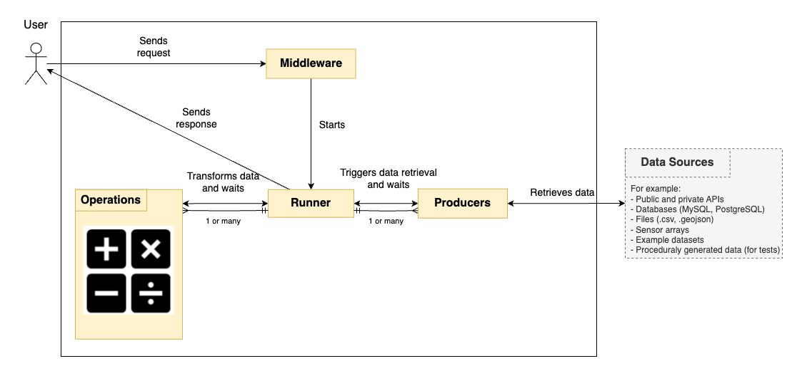

[](https://overbrowsing.com/projects/co2-shield)

The CITYdata middleware allows users to fetch, transform, and process data from various sources using Producers and Operations.

## What is it?

CITYdata is a part of the [TOOLS4CITIES](https://www.concordia.ca/research/cities-institute/initiatives/tools4cities.html) tool suite. It is a middleware that enables users to perform operations on data from different sources via the use of the following abstractions:

- Producer: connects to data sources and fetches data
- Operation: describes transformations to be performed on producer outputs (data)
- Runner: calls a series of producers, executes a series of operations on the producer's outputs, and then outputs the resulting data



You can see a more detailed breakdown of responsibilities for the middleware [here](./docs/architecture.png).

## What do I need?

- Java 21
- Maven version 3.7.x
- OpenSSL (needed for public/private key generation)
- Python 3 (needed for credential management)
- Postman (optional)

To collaborate with CITYdata, you can use the Java IDE of your choice. The CITYdata development team members use either Eclipse 2024-06 (4.32.0) or IntelliJ IDEA 2024.3.4.1.

## How do I set it up?

The easiest way to set up a new CITYdata instance is by using Docker. This repository contains a `docker-compose.yml` and a `Dockerfile`, which means you can easily create a CITYdata container by running `docker compose up -d`. However, if you do not wish to use Docker, please follow the instructions in this section.

### 1. Generate keypair

When you create a CITYdata instance, we strongly recommend that you set up credentials to prevent unauthorized access. To do so, you must start by generating a keypair (public + private key) using `openssl`:

1. Create a folder named `certs` inside the `src/main/resources/scripts` directory.
2. Navigate to the `certs` folder and run the following commands:

```bash
openssl genrsa -out keypair.pem 2048
openssl rsa -in keypair.pem -pubout -out public.pem
openssl pkcs8 -topk8 -inform PEM -outform PEM -nocrypt -in keypair.pem -out private.pem
```

3. Once the keys are generated, you can delete the file `keypair.pem` since it is no longer necessary.

On the next step, this keypair will be used to encrypt the passwords of the users you will create.

### 2. Create credentials

To define which users will have access to your CITYdata instance, please use the script `credentials-manager.sh`. Here is you set it up:

1. On the Python environment of your choice, install the `bcrypt` package:

```sh
	pip install bcrypt
```

2. Navigate to the following directory in this project:

```sh
	cd src/main/resources/scripts
```

3. Run the credentials manager script:

```sh
	./credentials-manager.sh
```

4. An interactive menu will appear, allowing you to add, remove, or update users in `citydata`. You must define a password for every user.

The list of users and passwords will be saved to the file `src/main/resources/scripts/credentials/credentials.txt`. Passwords are encrypted and will be decrypted by CITYdata using the keys you generated on the previous step. If you ever regenerate your keypair, the credentials file will have to be recreated as well.

### 2.1. What if I do not want to set up credentials?

While we **strongly encourage you to set up credentials**, you have two options in case you do not wish to do so:

### 2.1.1. Use default credentials

If you did not create a `credentials.txt` file, you can authenticate with default credentials (username and password = `citydata`). This may be a good choice if you simply want to spin up an instance of CITYdata quickly for experimentation in your local development environment. However, this approach is not recommended for production environments because it brings the following negative consequences:

1. Your CITYdata instance WILL NOT BE PROTECTED!
2. You will not be able to register users. While you can change the default username and password in the `application.properties`, you will still be limited to a single user.
3. You will see a warning printing to your terminal every time you authenticate.

Once you register your credentials using the script `credentials-manager.sh`, the default credentials will be automatically disabled to avoid unauthorized access.

### 2.1.2. Use the NGCI CITYdata instance

The [Next-Generation Cities Institute](https://www.concordia.ca/research/cities-institute.html) at [Concordia University](https://www.concordia.ca) hosts its own instance of CITYdata. If you wish to use this instance, please reach out to [this email address](#who-do-i-talk-to) so we can register you as a user.

### 3. Compile the code

1. Install Java and Maven in your operating system
2. Open the terminal and check Java installation by typing `java --version`. If Java is set up correctly, you should see the Java version number printed on your terminal.

#### 3.1 Eclipse

1. Open Eclipse. On the left-side menu, select `Import > Maven > Existing Maven Projects`.
2. Select project directory: `tools4cities-middleware`.
3. Click `Finish` and wait for the project to load.
4. After loading, right-click the `Middleware` folder, and select `Maven > Update Project`.
5. Right-click again and select: `Run As > maven install`
6. Right-click again and select: `Run As > maven test`

#### 3.2 IntelliJ

Please follow the steps described [here](https://www.jetbrains.com/help/idea/import-project-from-eclipse-page-1.html).

#### 3.3 Command line

If you have `mvn` set up in the command line, go to the Middleware folder and run the following commands:

```bash
mvn dependency:purge-local-repository -DactTransitively=false -DreResolve=false
mvn clean
mvn validate
mvn install
```

As a result of the compilation, Maven will generate a `.jar` file. You can run it as follows:

```bash
java -jar ./target/Middleware-0.0.1-SNAPSHOT.jar --server.port=8080
```

## How do I use it?

- CITYdata is a REST API which receives queries as input and generates data as output.
- A query is a JSON file where you specify which data you want and which transformations you wish to apply to the data. You can see query examples in the folder `/docs/examples/queries`.
- You can call CITYdata routes using your favourite programming language. For example, you can use the requests package in [Python](https://www.geeksforgeeks.org/get-post-requests-using-python/) or the fetch API in [JavaScript](https://developer.mozilla.org/en-US/docs/Web/API/Fetch_API/Using_Fetch).
- If you are familiar with Postman, you can use our Postman collection [here](https://github.com/ptidejteam/citydata/blob/master/Middleware/docs/citydata_collection.json) to send your queries, no need to write code.

The following routes are available:

| **Method** | **API Route URL**       | **Description**                                                                              | **Input**                        |
| ---------- | ----------------------- | -------------------------------------------------------------------------------------------- | -------------------------------- |
| GET        | /authenticate        | Gives you a token to access CITYdata                                     | Your username and password in the request Authorization header                            |
| GET        | /producers/list         | Lists all Producers and their parameters                                                     |                                  |
| GET        | /operations/list        | Lists all Operations and their parameters                                                    |                                  |
| POST       | /apply/sync             | Executes query synchronously (will not return until completed)                               | A JSON query in the request body |
| POST       | /apply/async            | Executes query asynchronously (will return a runner ID instantly)                            | A JSON query in the request body |
| GET        | /apply/async/{runnerId} | Returns status of a runner ID. If the runner is completed, returns the prime Producer result | A runner ID                      |
| GET        | /apply/ping             | Returns pong (this is great to test if the middleware is running 😊)                         |                                  |
| POST       | /exists                 | Returns a list of prime Producers which match the given query                                | A JSON query in the request body |

For now, the number of Producers, Operations and parameters is quite limited, but we intend to expand it in the future and also document it better. Your suggestions are more than welcome!

## Accessing Private/Protected Routes

To access the private or protected routes, follow these steps:

- Create a User Account:
  - Follow the instructions in [this section](#2-create-credentials) to create a username and password

- Authenticate the User:
  - Run the application and send a `POST` request to the following endpoint:
    http://localhost:8080/authenticate

Include your username and password in the request body as JSON, for example:

```json
{
  "username": "yourUsername",
  "password": "yourPassword"
}
```

- Receive Authentication Token:
  - Upon successful authentication, a token will be returned in the response

- Copy the Token:
  - Copy the token from the response. You'll use this to access protected routes

- Access Protected Routes:
  - Use one of the following endpoints:

    POST http://localhost:8080/apply/sync
    POST http://localhost:8080/apply/async

- Add Authorization Header in Postman:
  - In Postman (or any API client)
  - Go to the `Authorization` tab
  - Set Type to `Bearer Token`
  - Paste the token into the `Token` field

- Access Granted:
  - If the token is valid, Spring Boot will authorize your request and grant access to the protected route

## Available Data Sources

- [Dataset Catalog](DATA_SOURCES.md) - Complete list of all available datasets

## Who do I talk to?

Project manager: gabriel.cavalheiroullmann at concordia.ca

## Development Guidelines

- The develop branch is the working branch for CityData middleware developers. To integrate your changes, please create a new branch based on develop, apply your changes, then open a **pull request** and set develop as a target.
- One or more members of the CityData development team will **review every pull request** and provide improvement suggestions to the PR authors, if necessary.
- The CityData development team merges the develop branch into master **monthly** or whenever we have enough major features to justify a new release.
- All developers **must write tests** to demonstrate the correct usage of Producers and Operations while ensuring these classes function as intended.
